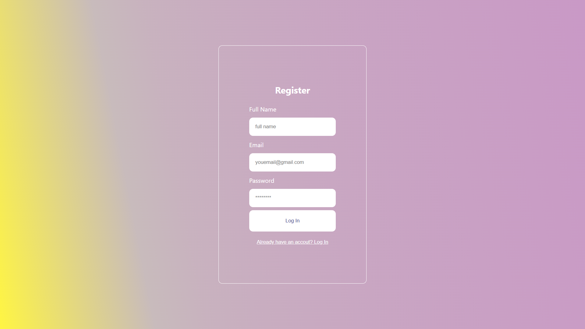

## Login-Register Page
# Overview
This project is a login-register page built using React and Material UI. It provides a user-friendly interface for users to log in or register an account. The project showcases the implementation of modern web technologies to create a responsive and attractive user experience.

# Features
User Authentication: Allows users to register an account and log in.
Responsive Design: Ensures compatibility across various devices and screen sizes.
Material UI: Utilizes Material UI components for a sleek and professional look.
Form Validation: Includes form validation to ensure the correctness of user inputs.

### Demo

# Installation
To run this project locally, follow these steps:

# Clone the repository:
sh
Copy code
git clone https://github.com/Vipinverma10/login-register-page.git
Navigate to the project directory:
sh
Copy code
cd login-register-page
Install the dependencies:
sh
Copy code
npm install
Start the development server:
sh
Copy code
npm start
The application will be available at http://localhost:3000.

# Technologies Used
React: A JavaScript library for building user interfaces.
Material UI: A popular React UI framework for building responsive and attractive web applications.
## Project Structure
The project structure is organized as follows:

login-register-page/
├── public/
│   ├── index.html
│   └── ...
├── src/
│   ├── components/
│   │   ├── Login.js
│   │   ├── Register.js
│   │   └── ...
│   ├── App.js
│   ├── index.js
│   └── ...
├── package.json
└── README.md
Usage
Register
Navigate to the register page.
Fill in the required fields (e.g., username, email, password).
Click the "Register" button to create an account.
Login
Navigate to the login page.
Enter your registered email and password.
Click the "Login" button to access your account.
# Contributing
Contributions are welcome! If you have any suggestions or improvements, please open an issue or create a pull request.

Fork the repository.
Create a new branch:
sh
Copy code
git checkout -b feature/YourFeatureName
Make your changes and commit them:
sh
Copy code
git commit -m 'Add some feature'
Push to the branch:
sh
Copy code
git push origin feature/YourFeatureName
Open a pull request.
# License
This project is licensed under the MIT License. See the LICENSE file for details.

# Contact
If you have any questions or feedback, feel free to reach out:

GitHub: Vipinverma10
Email: vipinverma100118@gmail.com